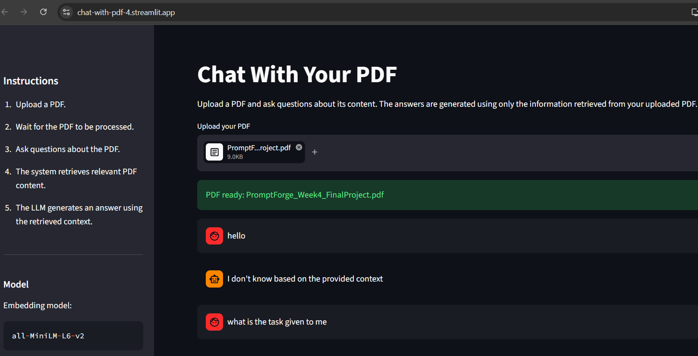
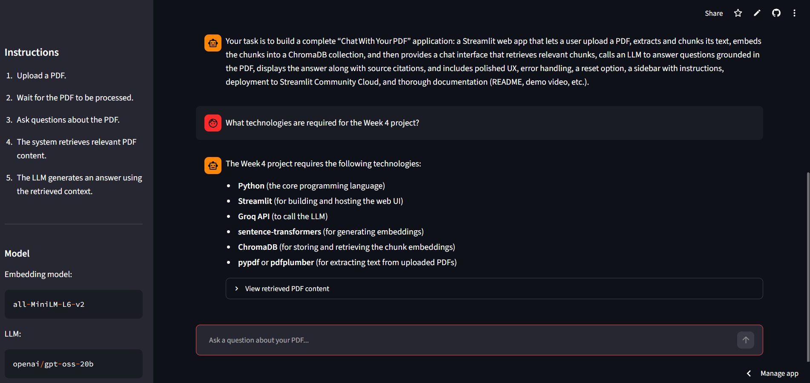
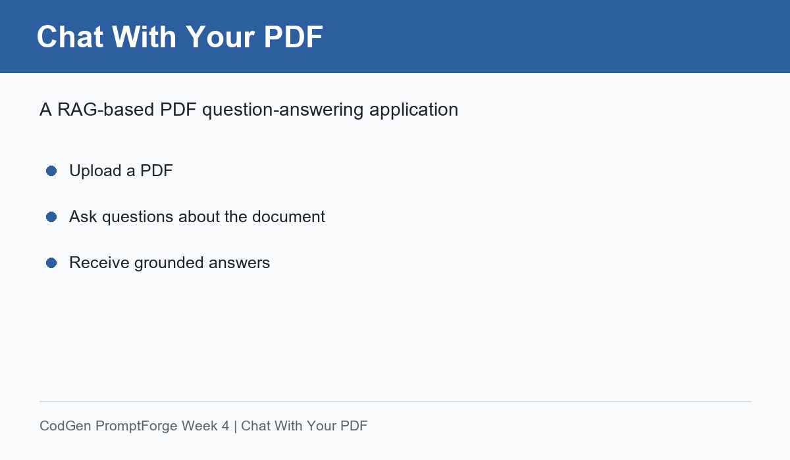

# Chat With Your PDF

A RAG-based PDF question-answering application built with Python, Streamlit, ChromaDB, sentence-transformers, and Groq LLM.

## Overview

Chat With Your PDF is a Retrieval-Augmented Generation (RAG) application that allows users to upload a PDF document and ask questions about its content.

The application extracts text from the uploaded PDF, divides the text into overlapping chunks, creates embeddings using a sentence-transformer model, stores the embeddings in ChromaDB, and retrieves the most relevant chunks for each user question.

The retrieved PDF content is then provided to the Groq LLM as context so that the generated answer is grounded in the uploaded document.

If the requested information cannot be found in the retrieved PDF context, the application responds:

> I don't know based on the provided context

## Features

- Upload PDF documents through a Streamlit interface
- Extract text from PDF files
- Split extracted text into overlapping chunks
- Generate embeddings using sentence-transformers
- Store document embeddings using ChromaDB
- Retrieve relevant PDF content using semantic search
- Generate grounded answers using Groq LLM
- Maintain conversation history during the session
- Display retrieved PDF content used for answering
- Support starting a new chat without re-uploading the current PDF
- Detect PDFs with no extractable text
- Handle empty or invalid PDF processing cases
- Deployable using Streamlit Community Cloud

## Technologies Used

- Python
- Streamlit
- Groq API
- ChromaDB
- sentence-transformers
- pypdf
- Python dotenv

## Models Used

### Embedding Model

```text
all-MiniLM-L6-v2
## Screenshots

### PDF Upload



### Question and Answer



### Demo

